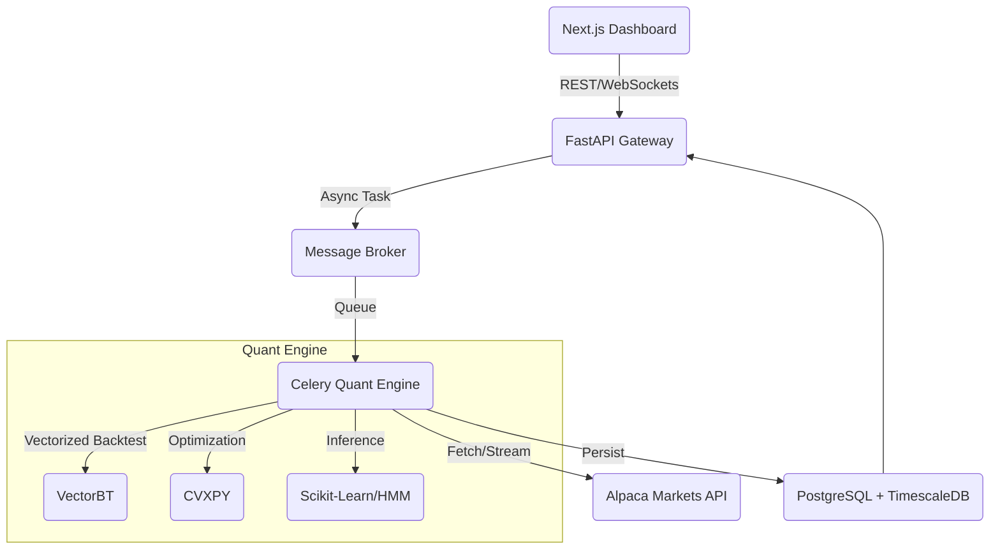

# QuantLEO
quanting into janestreet
***

# QuantLEO: Autonomous Portfolio Management System (PMS)

**QuantScale** is a full-stack algorithmic trading platform designed to simulate the lifecycle of a quantitative hedge fund. It enables users to parameterize strategies, perform rigorous backtesting using vectorized computation, and execute paper trades via the Alpaca API.

Unlike retail trading bots that rely on technical indicators (RSI, MACD), QuantScale utilizes **stochastic calculus**, **convex optimization**, and **unsupervised machine learning** to solve for optimal portfolio allocation while strictly adhering to risk constraints.

---

## 🏗 System Architecture

The system is architected as a set of microservices orchestrated via Docker Compose, ensuring separation of concerns between the user interface, API gateway, and heavy computational workers.

### Core Components
*   **Frontend:** Next.js (React/TypeScript) with Plotly.js for 3D volatility surface rendering and interactive financial charting.
*   **Backend:** FastAPI for high-throughput asynchronous request handling.
*   **Task Queue:** Redis & Celery to handle long-running optimization tasks without blocking the HTTP main loop.
*   **Database:** PostgreSQL with TimescaleDB extension for efficient time-series storage and windowing functions.

---

## 🧠 Quantitative Methodologies (Deep Dive)

This project moves beyond heuristic trading by implementing rigorous mathematical models for signal generation and portfolio construction.

### 1. State-Space Modeling (Dynamic Pairs Trading)
Standard pairs trading relies on OLS regression, which assumes a static hedge ratio ($\beta$). However, market relationships are non-stationary.
*   **Implementation:** We utilize a **Kalman Filter** to dynamically estimate the "hidden state" (the cointegration coefficient) of a pair.
*   **The Math:**
    We model the hedge ratio $\beta_t$ as a random walk:
    The hedge ratio is modeled as a time-varying parameter:
    βₜ = βₜ₋₁ + ωₜ
    ωₜ ~ Normal(0, Q)
    The observed spread yₜ is given by: yₜ = xₜ · βₜ + εₜ, εₜ ~ Normal(0, R)

This formulation allows the hedge ratio to evolve over time rather than remain fixed. As a result, the algorithm can adapt to structural breaks or regime changes in asset correlation, reducing drawdowns during prolonged divergence events.
    This allows the algorithm to adapt to structural breaks in correlation instantly, reducing drawdown during divergence events.

### 2. Market Regime Detection (Unsupervised Learning)
Strategies that work in bull markets often fail in high-volatility sideways markets.
*   **Implementation:** A **Gaussian Hidden Markov Model (HMM)** is trained on VIX and SPY returns to classify the market into latent states (e.g., *Low Vol/Bull*, *High Vol/Panic*).
*   **Application:** The risk manager module adjusts the leverage ratio dynamically based on the detected state probability P(Sₜ | Data).

### 3. Robust Portfolio Optimization
We reject Mean-Variance Optimization (MVO) due to its sensitivity to input noise (estimation error maximization).
*   **Implementation:** We use **Convex Optimization (`cvxpy`)** to solve for weights $w$.
*   **Objective:** Maximize Utility subject to **L1 Regularization** (sparsity) and **Turnover Constraints** (transaction costs).
    Maximize:
    wᵀ μ − λ · wᵀ Σ w − γ · ||w||₁
    Subject to the constraints:
    Sum of weights equals 1 (∑ wᵢ = 1)
    No short-selling (wᵢ ≥ 0)
    Turnover constraint between rebalancing periods (||wₜ − wₜ₋₁||₁ ≤ δ)
    Where:
    - w is the portfolio weight vector
    - μ is the expected return vector
    - Σ is the covariance matrix
    - λ controls risk aversion
    - γ controls sparsity (L1 regularization)
    - δ limits excessive trading and transaction costs
This formulation balances return maximization, risk control, sparse portfolios, and realistic turnover constraints.

*   **Covariance Cleaning:** We apply **Ledoit-Wolf Shrinkage** to the covariance matrix $\Sigma$ to mitigate off-diagonal noise.

---

## ⚡ Performance Engineering

*   **Vectorized Backtesting:** Utilizing `vectorbt` and `numpy` broadcasting to run 5-year backtests on S&P 500 constituents in sub-second timeframes.
*   **Look-Ahead Bias Prevention:** The backtesting engine enforces strict time-indexing. Signals generated at $t$ are executed at $t+1_{open}$ to simulate realistic slippage and execution delay.
*   **Asynchronous Execution:** Heavy math jobs are offloaded to Celery workers, ensuring the API remains responsive to heartbeat checks and UI updates.

---

## 🛠 Tech Stack

| Component | Technology | Rationale |
| :--- | :--- | :--- |
| **Language** | Python 3.10+ | Standard for Quant Research. |
| **Math** | `numpy`, `pandas`, `scipy` | Core linear algebra and statistical operations. |
| **Optimization** | `cvxpy` | Solving convex optimization problems with constraints. |
| **Filtering** | `pykalman` | Dynamic Bayesian state estimation. |
| **Backtesting** | `vectorbt` | High-performance vectorized backtesting. |
| **API** | FastAPI | Async Python web framework. |
| **Brokerage** | Alpaca API | Market data and Paper Trading execution. |
| **Containerization** | Docker | Consistent environment across Dev/Prod. |

---

## 🚀 Getting Started

### Prerequisites
*   Docker & Docker Compose
*   Alpaca API Keys (Paper Trading)

---

## 📉 Example Usage Flow

1.  **Select Universe:** User selects "Energy Sector" (XOM, CVX, COP, etc.).
2.  **Configure Strategy:** Select "Kalman Pair Switching" with a Risk Target of 10% Volatility.
3.  **Simulate:** The system pulls 2 years of OHLCV data, computes the geometric Brownian motion of the spread, and runs the backtest.
4.  **Analyze:** View the Tear Sheet (Sharpe, Sortino, Max Drawdown).
5.  **Deploy:** Click "Start Paper Trading." The Celery worker initializes a cron job to rebalance the portfolio every market open.

---

*Project maintained by Tan Jia Jun & Zhao Shi Zhen*
